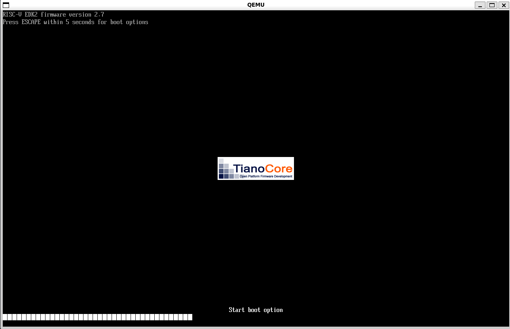
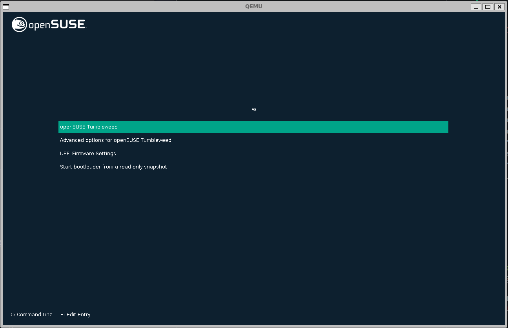
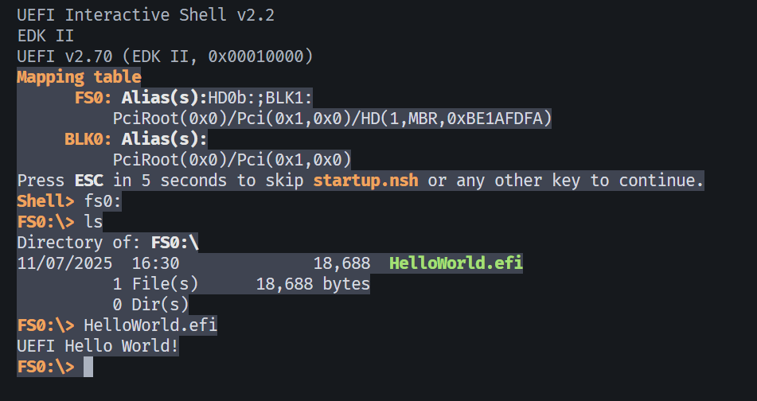

# edk2-demo-rv64
A helloworld-level demo for edk2 on qemu-system-riscv64.

**EDK2 for RISC-V virt platform is a payload (S-mode)** for the previous stage M-mode firmware like OpenSBI. It follows PEI less design.




## Quick Start

### 1. run standard opensuse OS
```bash
./run-opensuse-riscv.sh
```


### 2. run helloworld
```bash
./run-helloworld.sh
```


## Compile it youself

### 0. environment

Prepare cross-compile-toolchain and qemu-system-riscv64 (version>=8.1).

### 1. edk2 firmware

```bash
# Clone source code from github
# '--depth 1' could reduce commit information that you don't need.
git clone git@github.com:tianocore/edk2.git --depth 1
git submodule update --init --recursive

# Compile Basetools
export WORKSPACE=`pwd`
export GCC5_RISCV64_PREFIX=riscv64-linux-gnu-
export PACKAGES_PATH=$WORKSPACE/edk2
export EDK_TOOLS_PATH=$WORKSPACE/edk2/BaseTools
source edk2/edksetup.sh --reconfig  # Override edk2/Conf/target.txt
make -C edk2/BaseTools              # compile tools (such as 'build' below)

# Compile Related Pkg
source edk2/edksetup.sh BaseTools   # export tools (sub as 'build' cmd below)
build -a RISCV64 --buildtarget RELEASE -p OvmfPkg/RiscVVirt/RiscVVirtQemu.dsc -t GCC5
```
The args after build are used to override the content in Conf/target.txt.

- `-a RISCV64`: TARGET_ARCH = RISCV64           (default IA32 in target.txt)
- `--buildtarget RELEASE`: TARGET = RELEASE     (default DEBUG in target.txt)
- `-t GCC5`: TOOL_CHAIN_TAG = GCC5              (default VS2022)
- `-p OvmfPkg/RiscVVirt/RiscVVirtQemu.dsc`: ACTIVE_PLATFORM = OvmfPkg/RiscVVirt/RiscVVirtQemu.dsc

> Note: You can change `Conf/target.txt` which is used by `build` cmd.
> It can achieve the same goal.

Then you can get the `RISCV_VIRT_CODE.fd` and `RISCV_VIRT_VARS.fd` in `Build/RiscVVirtQemu/RELEASE_GCC5/FV` directory.

```bash
# Resize to fixed size 32M.
truncate -s 32M RISCV_VIRT_CODE.fd
truncate -s 32M RISCV_VIRT_VARS.fd
```
Then you can place them in pflash on `virt` machine like `run-opensuse-riscv.sh` or `run-helloworld.sh`.

- RISCV_VIRT_CODE.fd: Read-Only, here I place it under dir ./firmware/
- RISCV_VIRT_VARS.fd: Read-Write, here I place it under dir ./flash/

### 2. edk2 helloworld

```bash
build -a RISCV64 --buildtarget RELEASE -p MdeModulePkg/MdeModulePkg.dsc -t GCC5
```

### 3. edk2 -> grub2

TODO:

## Reference
- https://github.com/tianocore/edk2/tree/master/OvmfPkg/RiscVVirt

- https://www.bilibili.com/opus/548368024058462271

- https://www.bilibili.com/opus/548437177325385603

- https://zhuanlan.zhihu.com/p/4238237997

- https://gitee.com/openeuler2020/team-1375238611
